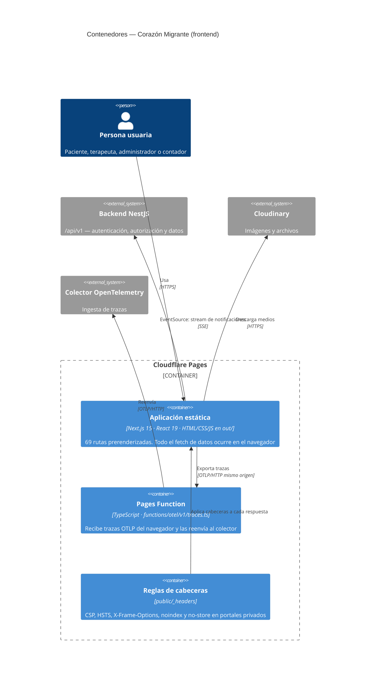

# Contenedores (C4 nivel 2)

- **Fecha de evidencia:** 2026-08-03

---

## 1. Diagrama de contenedores



---

## 2. Contenedores

### 2.1 Aplicación estática

| Atributo | Valor |
|---|---|
| Tecnología | Next.js 15.4.7, React 19.2.0, TypeScript 5.9 |
| Artefacto | Directorio `out/` (HTML + `_next/static/`) |
| Construcción | `yarn build` → `next build` con `output: "export"` |
| Tamaño compartido | 100 kB de JS en todas las rutas |
| Ruta más pesada | `/` con 194 kB de First Load JS |
| Estado | Todo en el navegador: React Query + Context |

Contenido de `out/` verificado tras el build: `403/`, `404/`, `404.html`, `_headers`, `_next/`, `admin/`, `biblioteca/`, `booking/`, `cursos/`, `favicon.ico`, `icon.svg`, `index.html`, `index.txt`, `inicio/`, `login/`, `manifest.webmanifest`, `noticias/`, `novedades/`, `paciente/`, `privacidad/`, `registro/`, `robots.txt`, `sitemap.xml`, `terapeuta/`, `terminos/`.

**No existe `out/api/`.** Ver [rendering-strategy.md §2](rendering-strategy.md).

### 2.2 Cloudflare Pages Function

| Atributo | Valor |
|---|---|
| Archivo | [functions/otel/v1/traces.ts](../../functions/otel/v1/traces.ts) |
| Ruta pública | `/otel/v1/traces` |
| Función | Recibir el lote OTLP del navegador y reenviarlo al colector |
| Motivo de existir | Con `output: "export"` no hay Route Handler que pueda hacerlo en producción |

Es el **único código del frontend que se ejecuta fuera del navegador**.

### 2.3 Reglas de cabeceras

[public/_headers](../../public/_headers), leído por Cloudflare Pages desde la raíz del artefacto.

| Ámbito | Cabeceras |
|---|---|
| `/*` | `X-Frame-Options: DENY`, `X-Content-Type-Options: nosniff`, `Referrer-Policy: strict-origin-when-cross-origin`, `Permissions-Policy` (cámara, micrófono, geolocalización denegados), `Strict-Transport-Security: max-age=31536000; includeSubDomains`, `Content-Security-Policy` |
| `/admin/*`, `/paciente/*`, `/terapeuta/*` | `X-Robots-Tag: noindex, nofollow` + `Cache-Control: no-store` |
| `/_next/static/*` | `Cache-Control: public, max-age=31536000, immutable` |

Análisis de la CSP en [security/content-security-policy.md](../security/content-security-policy.md).

---

## 3. Canales de comunicación

| # | Origen → Destino | Protocolo | Autenticación | Notas |
|---|---|---|---|---|
| 1 | Aplicación → Backend | HTTPS/JSON vía `apiRequest()` | `Authorization: Bearer <jwt>` | Único punto de salida HTTP de datos |
| 2 | Aplicación → Backend | **SSE** (`EventSource`) | **JWT en la *query string*** | `/admin/notifications/stream?token=…`. ⚠️ Brecha `SEC-01` |
| 3 | Aplicación → Cloudinary | HTTPS | Ninguna en lectura | Subida firmada por el backend |
| 4 | Aplicación → Pages Function | OTLP/HTTP | Ninguna | Mismo origen |
| 5 | Pages Function → Colector | OTLP/HTTP | Según despliegue | Fuera del repositorio |

### El canal 2 merece atención

`EventSource` es la única API del navegador que **no permite cabeceras personalizadas**. Como no se puede enviar `Authorization`, el código pasa el token por la URL:

```ts
const url = `${sseUrl}?token=${encodeURIComponent(token)}`;
```

El propio código lo señala y protege la telemetría de ello — el span de conexión no registra ninguna URL, precisamente para que el JWT no acabe en una traza. Pero el token sigue viajando en una URL, que es lo que registran proxies, historiales y logs de acceso.

Alternativas conocidas (todas `CAMBIO DE PRODUCTO`): token de un solo uso y vida corta para el stream, cookie de sesión, o sustituir SSE por WebSocket con autenticación en el primer mensaje. Ver [security/threat-model.md](../security/threat-model.md).

---

## 4. Entornos

| Entorno | Aplicación | Telemetría | Debug log |
|---|---|---|---|
| Desarrollo | `next dev` en puerto 4173 (auto-selección) | Route Handler `/api/otel/traces` | `/api/debug-log` → `logs/api-requests.log` |
| Producción | `out/` estático en Cloudflare Pages | Pages Function `/otel/v1/traces` | **No existe** — desactivado por `NODE_ENV` |

Esta asimetría es deliberada y está comentada en el código. Detalle en [operations/environments.md](../operations/environments.md).
