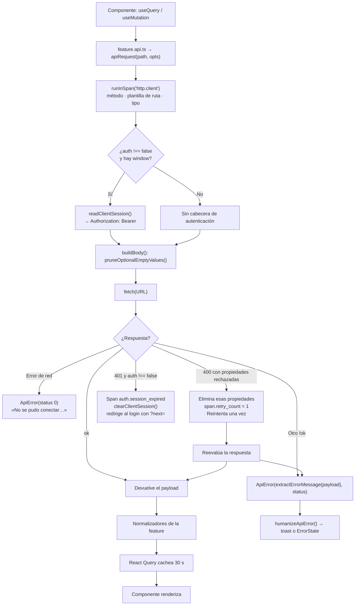
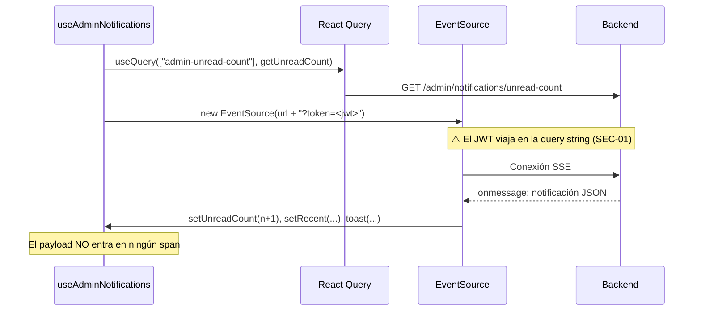

# Flujo de datos

- **Fecha de evidencia:** 2026-08-03
- **Evidencia primaria:** [src/shared/api/client.ts](../../src/shared/api/client.ts)

---

## 1. Recorrido completo de una petición



---

## 2. Construcción de la URL base

`apiBaseUrl()` aplica tres reglas antes de componer cualquier URL:

1. **Obligatoriedad.** Sin `NEXT_PUBLIC_API_BASE_URL` lanza `ApiError(…, 500)` con un mensaje que indica revisar `.env.local`.
2. **Normalización del prefijo.** Recorta un `/api/v1` o `/api` final. Si alguien configura `https://dominio.com/api/v1`, se evita `/api/v1/api/v1/auth/login`, porque `ENDPOINTS` ya incluye el prefijo.
3. **Protección en desarrollo.** Si la variable apunta al propio origen del frontend en `localhost`, lanza un error explicativo: el proyecto corre en 4173 y el backend debe estar en otro puerto.

---

## 3. Saneado del cuerpo — `pruneOptionalEmptyValues()`

Antes de serializar, se eliminan recursivamente:

- Valores `undefined` y `null`.
- Cadenas vacías cuya **clave** termine en `Id`, `Ids`, `At`, `Date`, `Until`, `From`, `To`, `Url`, `FileId` u `ObjectKey`.

Motivo: un `""` en un campo que el backend espera como UUID o fecha opcional produce un `400` de validación. Enviar el campo ausente es semánticamente correcto.

`FormData` se pasa intacto y **sin** cabecera `Content-Type`, para que el navegador añada el `boundary` de multipart.

---

## 4. Reintento por validación estricta

Cuando el backend responde `400` con mensajes del tipo `property X should not exist`, el cliente:

1. Extrae los nombres de propiedad con `extractRejectedProperties()`.
2. Marca `span.retry_count = 1`.
3. Reintenta **una sola vez**:
   - `GET` con query string → reintenta sin la query.
   - Cuerpo JSON → reintenta sin las propiedades rechazadas.
   - `FormData` → **no reintenta**.

Es una compatibilidad con `ValidationPipe({ forbidNonWhitelisted: true })` de NestJS. El comentario del código explica por qué se instrumenta: *«una petición que tarda el doble sin explicación suele ser esto»*.

**Qué no se registra:** los nombres de las propiedades eliminadas — son nombres de campos de formulario. Solo el número de reintentos.

---

## 5. Extracción del mensaje de error

`extractErrorMessage()` busca, en orden:

1. `payload.message` (cadena o array).
2. `payload.error.message`, recursivamente.
3. La primera cadena «significativa» del payload — descartando `HTTP_404`, identificadores en `MAYÚSCULAS_CON_GUIONES`, `"Bad Request"` y `"Unauthorized"`.
4. Fallback: `"Error de comunicación con el servidor"`.

El paso 3 es el que evita mostrar `HTTP_400` a la persona usuaria. `humanizeApiError()` (86 aristas) hace la traducción final a un mensaje presentable.

---

## 6. Manejo del `401`

```ts
function handleUnauthorizedSession() {
  startSpan(BUSINESS_SPANS.authSessionExpired, { feature: "auth", operation: "session-expired" }).end();
  clearClientSession();
  const loginPath = window.location.pathname.startsWith("/admin") ? "/admin/login" : "/login";
  if (currentPath !== loginPath) {
    window.location.replace(`${loginPath}?next=${encodeURIComponent(currentPath)}`);
  }
}
```

Solo se dispara si `options.auth !== false`: un `401` en una llamada deliberadamente pública no debe cerrar la sesión de nadie.

Se usa `window.location.replace` y no `router.replace` porque `apiRequest()` no es un componente y no tiene acceso al router. `replace` evita además que el botón «atrás» devuelva a la pantalla rota.

El span `auth.session_expired` distingue «la sesión murió y se expulsó a la persona» de un `401` cualquiera. Es de lo que más se investiga cuando alguien reporta que «se sale solo».

---

## 7. Registro de peticiones en desarrollo

`logApiCall()` envía cada petición y respuesta a `/api/debug-log`, que escribe en `logs/api-requests.log`.

Tres salvaguardas:

| Salvaguarda | Implementación |
|---|---|
| Solo en desarrollo | `if (typeof window === "undefined" \|\| process.env.NODE_ENV !== "development") return;` |
| Redacción de secretos | `sanitizeForLog()` reemplaza por `[redacted]` cualquier clave que coincida con `/password\|token\|secret\|authorization/i` |
| Truncado | `truncateForLog()` corta a 4 000 caracteres |

Además, `.catch(() => {})` y un `try/catch` envolvente: *«el logging nunca debe romper la app»*.

La guarda de `NODE_ENV` es funcional, no cosmética: en producción `/api/debug-log` **no existe** (no se exporta), y sin ella el navegador registraría un `405` en consola en cada llamada a la API.

---

## 8. Normalización de respuestas

El backend no es uniforme en cómo devuelve colecciones. `normalizePaginatedResponse()` (34 aristas) unifica las formas conocidas, y `isRecord()` / `getString()` protegen cada acceso a campo.

Cada feature añade sus propios normalizadores cuando hace falta — `public-view.normalizer.ts` y `editorial-normalizer` son los más extensos, y ambos **tienen prueba unitaria propia**.

---

## 9. Flujo de notificaciones (SSE) — la excepción

No pasa por `apiRequest()`:



`EventSource` no admite cabeceras personalizadas: es la razón técnica de que el token vaya en la URL. El span de conexión **no registra ninguna URL**, precisamente para que el JWT no acabe en una traza.

El `payload` de cada mensaje tampoco se instrumenta: puede contener el nombre de un paciente. Solo `event.type`, que es un valor de un conjunto cerrado de seis y no genera cardinalidad.
