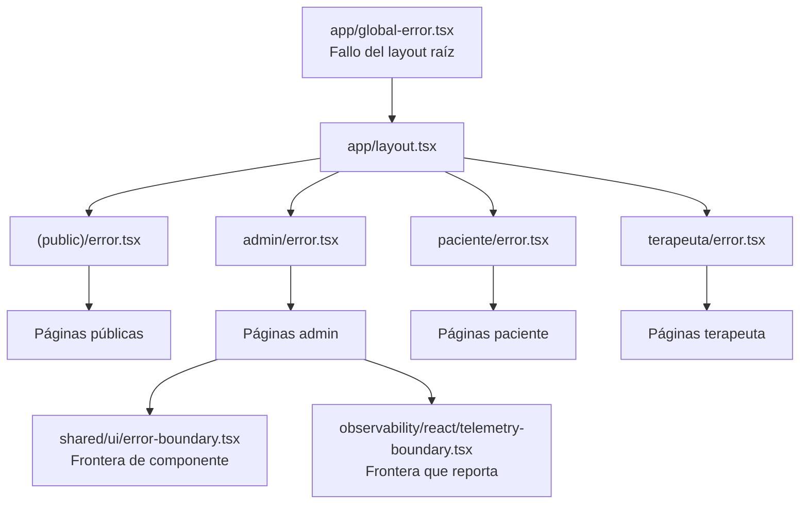

# Manejo de errores y fronteras

- **Fecha de evidencia:** 2026-08-03

---

## 1. Jerarquía de fronteras



| Archivo | Alcance | Se activa cuando |
|---|---|---|
| [app/global-error.tsx](../../src/app/global-error.tsx) | Toda la aplicación | Falla el propio layout raíz. Debe renderizar su propio `<html>` y `<body>` |
| [(public)/error.tsx](../../src/app/(public)/error.tsx) | Rutas públicas | Excepción no capturada en una página pública |
| [admin/error.tsx](../../src/app/admin/error.tsx) | `/admin/*` | Excepción en el portal admin |
| [paciente/error.tsx](../../src/app/paciente/error.tsx) | `/paciente/*` | Excepción en el portal paciente |
| [terapeuta/error.tsx](../../src/app/terapeuta/error.tsx) | `/terapeuta/*` | Excepción en el portal terapeuta |
| [shared/ui/error-boundary.tsx](../../src/shared/ui/error-boundary.tsx) | Componente | Aislar un fragmento de UI |
| [observability/react/telemetry-boundary.tsx](../../src/observability/react/telemetry-boundary.tsx) | Componente | Igual, pero además reporta a telemetría |

Los archivos `error.tsx` del App Router son **siempre** Client Components y reciben `{ error, reset }`.

---

## 2. Tipos de error y su tratamiento

| Origen | Clase | Dónde se captura | Qué ve la persona |
|---|---|---|---|
| Fallo de red | `ApiError(status 0)` | El componente que consulta | «No se pudo conectar con el servidor (…)» |
| `400` de validación | `ApiError(mensaje, 400)` | El formulario | Mensaje traducido por `humanizeApiError()` |
| `401` autenticado | — | `handleUnauthorizedSession()` | Redirección al login con `?next=` |
| `403` | `ApiError(mensaje, 403)` | El componente | Mensaje del backend |
| `404` de datos | `ApiError(mensaje, 404)` | El componente | `ErrorState` o estado vacío |
| `5xx` | `ApiError(mensaje, 5xx)` | El componente | «Error de comunicación con el servidor» |
| Excepción de render | `Error` | El `error.tsx` más cercano | Pantalla de error con opción de reintentar |
| Rol insuficiente | — | `ClientRoleGuard` | `ForbiddenState` en la misma URL |
| Ruta inexistente | — | `not-found.tsx` | 404 |
| Falta `NEXT_PUBLIC_API_BASE_URL` | `ApiError(…, 500)` | Primera llamada | Mensaje que indica revisar `.env.local` |
| Entorno inválido | `ZodError` | `envSchema.parse()` | **Falla el build o el arranque** |

---

## 3. `ApiError`

Definida en [shared/api/errors.ts](../../src/shared/api/errors.ts), transporta:

```ts
class ApiError extends Error {
  status: number;
  details: unknown;
}
```

- `message` — ya extraído del cuerpo por `extractErrorMessage()`.
- `status` — código HTTP, o `0` si ni siquiera hubo respuesta.
- **`details`** — contexto para diagnóstico. Se llama `details`, no `payload`.

Con `status: 0` conviven ahora tres finales distintos, discriminables por `details`:

| `details` | Significado | Reacción esperada |
|---|---|---|
| `{ cancelled: true }` | Lo canceló el consumidor (React Query descartando una consulta obsoleta) | **No es un fallo**: no mostrar aviso |
| `{ timeout: true }` | El servidor no respondió dentro del límite | Mensaje de reintento |
| `{ originalError }` | Fallo de red, DNS o TLS | Mensaje de conexión |

La distinción importa: sin ella, cada cancelación rutinaria de React Query se presentaría como un error del servidor.

`humanizeApiError()` es el nodo más conectado del sistema (**86 aristas**): convierte cualquier error en un mensaje presentable. Cambiarlo afecta a todos los mensajes de error visibles de la aplicación.

---

## 4. Validación de entorno: fallar pronto

[config/env.ts](../../src/config/env.ts) llama a `envSchema.parse()` **en el momento de importar el módulo**. Si una variable no cumple el esquema, la aplicación **no arranca**.

Es deliberado: es preferible un fallo inmediato y explícito en build a una aplicación desplegada que rompe en la primera petición.

El esquema aplica preprocesado defensivo:

- `optionalUrl` convierte `""` en `undefined` antes de validar el formato de URL — una variable declarada pero vacía no debe romper.
- `booleanFlag` acepta `"true"`, `"1"` y `"on"`; cualquier otra cosa es `false`.
- `publicPageSlugWithDefault` traduce los valores heredados `"1"` → `"inicio"` y `"2"` → `"biblioteca"`.

---

## 5. Errores en telemetría

`report-error.ts` y `react-error-reporter.ts` convierten excepciones en spans con estado de error.

Salvaguardas verificadas:

- `sanitizeErrorMessage()` en [observability/core/sanitize.ts](../../src/observability/core/sanitize.ts) redacta datos sensibles antes de que un mensaje se convierta en atributo.
- `SanitizingSpanProcessor` revisa cada span **antes de exportarlo**, como segunda capa.
- `FORBIDDEN_VALUE_PATTERNS` e `IDENTIFIER_SEGMENT_PATTERNS` definen qué no puede salir nunca.
- `route-template.ts` convierte rutas concretas en plantillas (`/admin/users/123` → `/admin/users/:id`), evitando cardinalidad ilimitada y fuga de identificadores.

Ambos módulos tienen prueba unitaria propia: `tests/unit/observability/sanitize.test.ts` y `route-template.test.ts`.

---

## 6. Errores que la aplicación absorbe en silencio

Decisiones deliberadas, documentadas para que nadie las confunda con fallos:

| Situación | Comportamiento | Justificación en el código |
|---|---|---|
| Falla `/api/debug-log` | Se ignora | «el logging nunca debe romper la app» |
| Falla el contador de no leídas | Muestra `0` | «El badge no es crítico: si la petición falla se muestra 0 en silencio» (`retry: false`) |
| Mensaje SSE malformado | Se descarta | `catch { /* malformed event — ignore */ }` |
| Token JWT ilegible | `readTokenExpiry()` devuelve `null` | No es una comprobación de seguridad; el backend valida |
| `localStorage` corrupto | `readClientSession()` devuelve `null` | `try/catch` sobre `JSON.parse` |
| Falla la telemetría | Inerte | La aplicación funciona sin observabilidad |

---

## 7. Brecha registrada

No existe **captura centralizada de errores en producción** (Sentry o equivalente). Los errores viajan como spans OTLP al colector, lo que permite diagnóstico pero no ofrece agrupación, alertado ni tendencias propias de una plataforma de *error tracking*.

Registrado como `OBS-01` en [reports/documentation-gap-analysis.md](../reports/documentation-gap-analysis.md). Ver [observability/error-reporting.md](../observability/error-reporting.md).
