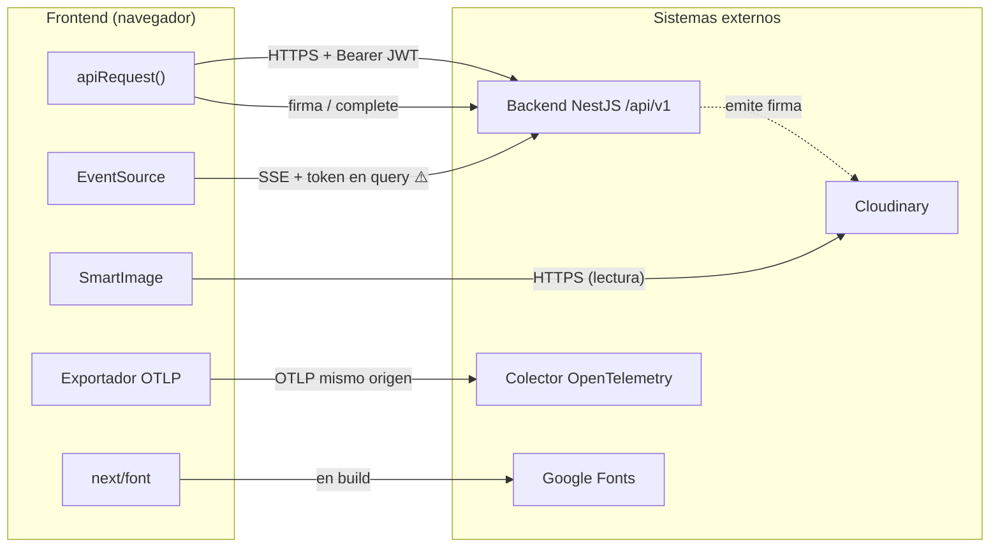
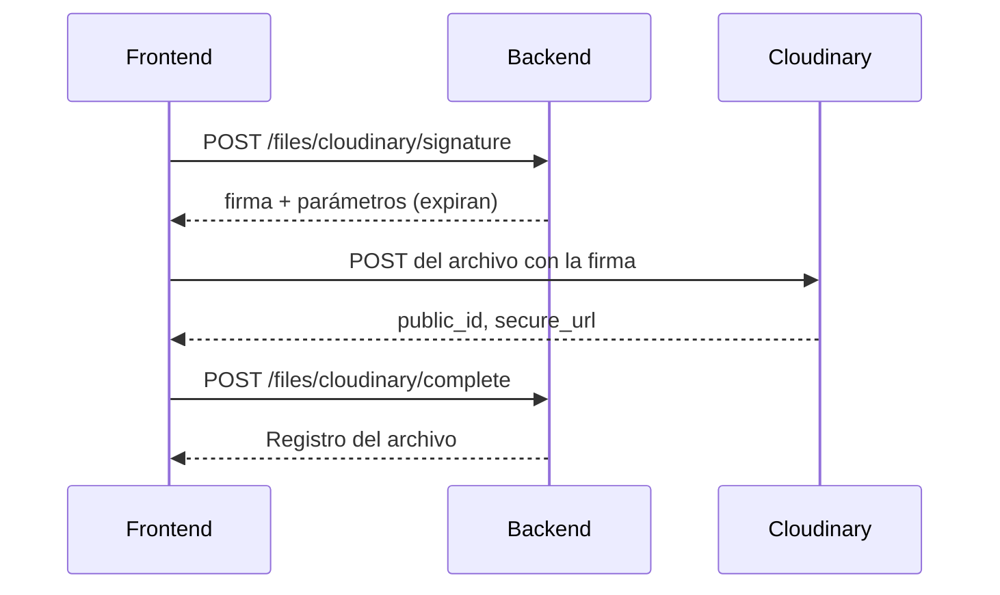

# Mapa de integraciones

- **Fecha de evidencia:** 2026-08-03
- **Derivado de:** [reports/graphify-audit.md](../reports/graphify-audit.md) + [src/shared/api/endpoints.ts](../../src/shared/api/endpoints.ts)

---

## 1. Panorama



---

## 2. Integraciones por criticidad

| # | Integración | Criticidad | Protocolo | Autenticación | Sin ella |
|---|---|---|---|---|---|
| 1 | Backend NestJS | **Máxima** | HTTPS/JSON | `Bearer <jwt>` | La aplicación no funciona |
| 2 | Notificaciones SSE | Media | SSE | **Token en query string** | Sin notificaciones en tiempo real |
| 3 | Cloudinary (lectura) | Alta | HTTPS | Ninguna | Sin imágenes |
| 4 | Cloudinary (subida) | Media | HTTPS firmado | Firma del backend | Sin subida de archivos |
| 5 | Colector OTel | Baja | OTLP/HTTP | Ninguna | Sin observabilidad; la app sigue |
| 6 | Google Fonts | Baja | HTTPS en build | Ninguna | Fuentes de sistema |

---

## 3. Backend NestJS — grupos de endpoints

`ENDPOINTS` declara ~110 rutas en 13 grupos, todas con prefijo `/api/v1`:

| Grupo | Rutas | Consumidores |
|---|---:|---|
| `auth` | 7 | `/login`, `/admin/login`, `/registro` |
| `users` | 13 | `/admin/usuarios`, perfiles |
| `appointments` | 5 | Solicitudes, citas, agenda |
| `booking` | 2 | Los cuatro formularios de reserva |
| `therapy` | 11 | Citas, horarios, disponibilidad |
| `products` | 13 | Enfoques y servicios |
| `cms` | 5 | Páginas públicas y editorial |
| `files` | 13 | Archivos y Cloudinary |
| `editorial` | 4 | Biblioteca (alias del CMS) |
| `content` | 9 | Suscripciones y premium |
| `publicUi` | 13 | Landing configurable |
| `accounting` | 16 | Contabilidad |
| `tutorials` | 2 | ⚠️ **El backend aún no los implementa** |
| `health` | 1 | Comprobación |

Detalle operación por operación en [integrations/backend-api.md](../integrations/backend-api.md).

---

## 4. Deriva contractual detectada

### 4.1 `tutorials` — contrato declarado, backend ausente

```ts
tutorials: {
  progress: `${API_PREFIX}/me/tutorials/progress`,
  progressById: `${API_PREFIX}/me/tutorials/progress/:tutorialId`
}
```

El propio comentario lo declara: *«Estado del contrato: PENDIENTE_CM … Mientras no exista, `NEXT_PUBLIC_TUTORIALS_REMOTE_PROGRESS` queda desactivado y el progreso vive solo en el navegador»*.

**Severidad: BAJA.** La bandera está apagada por defecto y el comportamiento degradado (progreso local) es correcto. Es un ejemplo de deriva **gestionada**, no de deuda oculta.

### 4.2 Stream SSE — endpoint fuera del registro

`buildSseUrl()` en [use-admin-notifications.ts](../../src/features/notifications/use-admin-notifications.ts) construye la URL a mano:

```ts
return `${clean}/api/v1/admin/notifications/stream`;
```

**No existe en `ENDPOINTS`.** Es la única ruta de backend definida fuera del registro central, lo que la deja fuera de cualquier revisión que se apoye en `endpoints.ts`.

**Severidad: MEDIA.** Registrado como `API-01`.

### 4.3 Rutas de notificaciones no registradas

`notifications.api.ts` expone `getUnreadCount`, `listNotifications`, `markAllRead` y `markNotificationRead`, pero `ENDPOINTS` **no tiene grupo `notifications`**. Mismo problema que 4.2, misma severidad.

### 4.4 Alias redundantes dentro de `ENDPOINTS`

Varios grupos apuntan a las mismas URLs con nombres distintos:

| Grupo | Ejemplo | Duplica a |
|---|---|---|
| `editorial` | `publicPage: /public/pages/:slug` | `cms.publicPage` |
| `publicUi` | `pageBundle`, `pageBySlug`, `pageElementByCode`, `pageElementById`, `elementsList` — **las cinco** a `/public/pages/:slug` | `cms.publicPage` |
| `therapy` | `appointmentRequests`, `patientAppointments`, `therapistAgenda` | `appointments.*` |

No es un error: son alias de aplicación que dan nombre de dominio a la misma URL. Se documenta para que nadie los cuente como endpoints distintos. **~110 claves declaradas ≈ 70 URLs únicas.**

### 4.5 Sin OpenAPI del backend en el repositorio

No hay especificación OpenAPI ni tipos generados. **Todos los tipos del frontend son manuales.**

Consecuencia: la única verificación real de contrato es `tests/integration/backend-contract.test.ts`, que requiere un backend accesible y no se ejecuta en CI.

Registrado como `API-02`, severidad **HIGH**. Ver [testing/contract-tests.md](../testing/contract-tests.md).

---

## 5. Cloudinary

**Lectura.** Más de una docena de variables `NEXT_PUBLIC_FILE_SERVER_*` apuntan a recursos concretos: logo, imagen de autenticación, héroes de landing y editorial, catálogos de especialidades, profesiones, países/ciudades, ocupaciones, síntomas, objetivos terapéuticos, y fotos de dos especialistas.

**Subida.** Flujo en tres pasos, sin credenciales en el frontend:



El frontend **nunca** posee el secreto de Cloudinary. Ver [integrations/file-storage.md](../integrations/file-storage.md).

---

## 6. Telemetría

| Entorno | Destino | Implementación |
|---|---|---|
| Desarrollo | `/api/otel/traces` | Route Handler de Next |
| Producción | `/otel/v1/traces` | [functions/otel/v1/traces.ts](../../functions/otel/v1/traces.ts) |

Ambos son **mismo origen**, por lo que la CSP no necesita abrir `connect-src` a ningún host externo por telemetría. Configuración de colector en [infra/otel-collector/](../../infra/otel-collector/).

---

## 7. Lo que no existe

| Integración | Estado |
|---|---|
| WebSockets | ❌ No se usan. El tiempo real es SSE — la CSP lo declara explícitamente |
| Pasarela de pago en el frontend | ❌ La suscripción premium se gestiona vía backend (`/me/news-subscription/payment-config`) |
| Analítica de terceros (GA, Segment, etc.) | ❌ Ninguna |
| Captura de errores (Sentry) | ❌ Ninguna |
| Mapas, chat o CRM externos | ❌ Ninguno |
| CDN de scripts de terceros | ❌ Ninguno — coherente con `script-src 'self'` |

La ausencia de scripts de terceros es una propiedad de seguridad y rendimiento **notable y deliberada**: es lo que permite mantener `script-src 'self' 'unsafe-inline' 'unsafe-eval'` sin abrir a dominios externos.
