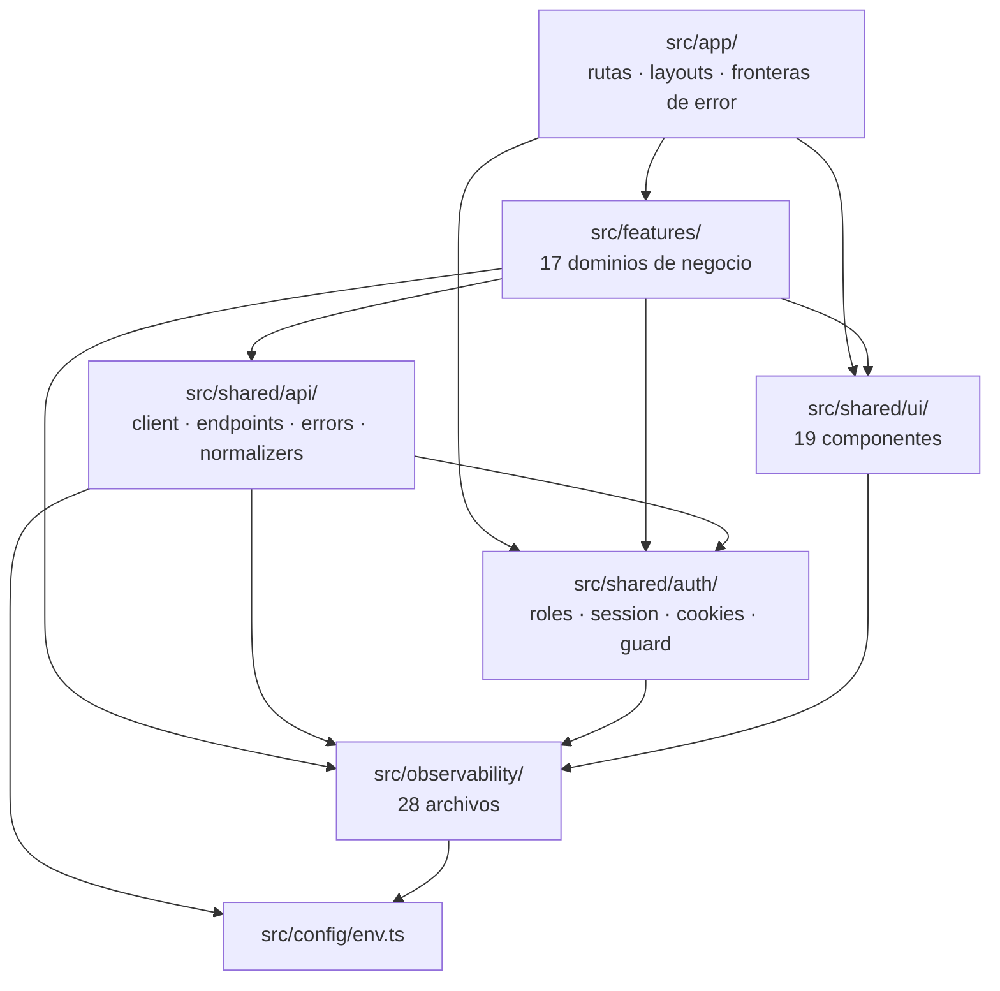

# Dependencias entre módulos

- **Fecha de evidencia:** 2026-08-03
- **Fuente:** [reports/graphify-audit.md](../reports/graphify-audit.md) (1 875 nodos, 4 635 aristas) contrastada con el árbol real

---

## 1. Dirección de dependencias



**Ninguna flecha apunta hacia arriba entre capas.** La jerarquía `app → features → shared` se respeta.

Existe, sin embargo, **un ciclo dentro de la capa transversal**, detectado al refrescar el grafo el 2026-08-03 (3 309 nodos, 6 783 aristas):

```
src/observability/index.ts
  → src/observability/react/telemetry-provider.tsx   (línea 63: export { TelemetryProvider })
  → src/shared/auth/use-session.tsx                  (línea 7: import { useSession })
  → src/observability/index.ts                       (línea 6: import { ATTR, BUSINESS_SPANS, … })
```

Es un **ciclo de barril**: `use-session.tsx` importa del barril `@/observability`, y ese barril reexporta un componente que a su vez necesita `useSession`.

| Aspecto | Valoración |
|---|---|
| ¿Funciona hoy? | **Sí.** El build pasa y las 368 pruebas están en verde |
| ¿Por qué importa? | Los ciclos de barril son frágiles: el orden de inicialización de módulos puede dar un import `undefined` en tiempo de ejecución según cómo se empaquete, y dificultan el *tree-shaking* |
| ¿Es nuevo? | Apareció con la integración de OpenTelemetry. El grafo anterior (commit `82e37332`) no lo contenía |
| Ruptura más simple | Que `use-session.tsx` importe de los módulos concretos (`@/observability/core/tracing.service`, `.../session-id`) en vez del barril |

Registrado como `ARCH-01`, severidad MEDIUM. **No se corrige aquí**: los tres archivos pertenecen a trabajo en curso del equipo y tocarlos podría chocar con lo que estén haciendo.

---

## 2. Reglas de dependencia verificadas

| Regla | ¿Se cumple? | Evidencia |
|---|---|---|
| `app/` no contiene lógica de negocio | ✅ mayoritariamente | Casi todos los `page.tsx` solo componen. **Excepción:** `admin/notificaciones/page.tsx` implementa React Query, mutaciones y paginación directamente en la página |
| `app/` no llama a la API directamente | ⚠️ una excepción | `(public)/[slug]/page.tsx` invoca `listCmsPages()` en `generateStaticParams` — es correcto y necesario, ocurre en build |
| `features/` no importa de otras `features/` | ⚠️ hay cruces legítimos | `public-content` y `public-view` se combinan en dos páginas admin; `profile` usa `users.api.ts` |
| `shared/` no importa de `features/` | ✅ | Sin excepciones |
| Todo HTTP pasa por `apiRequest()` | ✅ con una salvedad | El stream SSE usa `EventSource` directamente, no `apiRequest()` |
| `observability/` no depende de negocio | ✅ | Solo de `config/env.ts` |

---

## 3. Abstracciones núcleo (god nodes)

Ordenadas por número de aristas en el grafo. Cambiar cualquiera de ellas tiene radio de impacto amplio y **obliga a actualizar la documentación asociada**.

| Nodo | Aristas | Archivo | Qué rompe si cambia |
|---|---:|---|---|
| `humanizeApiError()` | 86 | `shared/api/errors.ts` | Todos los mensajes de error visibles |
| `apiRequest()` | 64 | `shared/api/client.ts` | Toda comunicación con el backend |
| `Button` | 52 | `shared/ui/button.tsx` | Toda acción de la interfaz |
| `isRecord()` | 44 | `shared/api/normalizers.ts` | Normalización de todas las respuestas |
| `PageHeader()` | 42 | `shared/ui/page-header.tsx` | Cabecera de casi toda pantalla |
| `cn()` | 41 | `shared/ui/*` | Composición de clases en todo el sistema de diseño |
| `getString()` | 38 | `shared/api/normalizers.ts` | Extracción de campos |
| `Card()` / `CardContent()` | 37 / 37 | `shared/ui/card.tsx` | Contenedores de toda la interfaz |
| `normalizePaginatedResponse()` | 34 | `shared/api/normalizers.ts` | Todas las tablas paginadas |

**Interpretación:** cinco de los diez pertenecen a `shared/api/`. La defensa contra la variabilidad del backend está concentrada en un solo lugar, lo cual es la razón por la que los contratos pueden documentarse de forma centralizada en [integrations/backend-api.md](../integrations/backend-api.md).

Los otros cinco son el núcleo real del sistema de diseño. **Ninguno tiene prueba de componente propia** (la única en `shared/ui` es `smart-image.test.tsx`). Brecha `TEST-02`.

---

## 4. Acoplamiento por feature

Medido por el número de módulos compartidos que importa cada feature:

| Feature | `shared/ui` | `shared/api` | `shared/auth` | `observability` | Observación |
|---|:--:|:--:|:--:|:--:|---|
| `newsroom` | ✅ | ✅ | ✅ | ✅ | La más extensa: publicaciones, taxonomía, publicidad, premium |
| `editorial` | ✅ | ✅ | ✅ | ✅ | CMS público + administración |
| `therapy` | ✅ | ✅ | ✅ | ✅ | Citas, agenda, horarios |
| `users` | ✅ | ✅ | ✅ | ✅ | — |
| `accounting` | ✅ | ✅ | ✅ | ✅ | — |
| `booking` | ✅ | ✅ | ✅ | ✅ | Tres variantes de formulario |
| `public-view` | ✅ | ✅ | — | ✅ | Landing configurable |
| `tutorial` | ✅ | — | ✅ | ✅ | **Sin cliente API**: el progreso vive en el navegador |
| `notifications` | ✅ | ✅ | ✅ | ✅ | Único consumidor de SSE |
| `landing` | ✅ | — | ✅ | — | Solo shell público |

`tutorial` es la feature con menor acoplamiento a datos remotos y la de mayor cobertura de pruebas (10 de 22 suites). No es casualidad: **lo que no depende del backend es lo que resulta fácil de probar**. Es el argumento cuantificado a favor de la brecha `TEST-01`.

---

## 5. Comunidades de baja cohesión

Del informe Graphify. Se registran como **señales para revisión**, no como deuda confirmada:

| Comunidad | Cohesión | Lectura |
|---|---:|---|
| `landing-v2-page.tsx` | 0,06 | Presentación, analítica y normalización en el mismo ámbito |
| `session.ts` | 0,09 | Agrupa sesión, middleware y validación de catálogo de tutoriales: artefacto del algoritmo, no del código |
| `editorial.api.ts` | 0,09 | El dominio editorial es genuinamente amplio |
| `users.api.ts` | 0,11 | Mezcla usuarios, descargables y Hotmart |

**Ninguna refactorización se propone aquí.** Sería `CAMBIO DE PRODUCTO`. La cohesión la calcula un algoritmo de detección de comunidades sobre el grafo y agrupa nodos que el código mantiene en archivos separados.

---

## 6. Dependencias externas críticas

| Paquete | Versión | Criticidad | Qué pasa si falla |
|---|---|---|---|
| `next` | 15.4.7 | **Máxima** | No hay aplicación |
| `react` / `react-dom` | 19.2.0 | **Máxima** | No hay aplicación |
| `@tanstack/react-query` | ^5.90.12 | Alta | Se pierde todo el estado de servidor |
| `zod` | ^4.2.1 | Alta | Fallan validación de entorno, sesión y formularios |
| `react-hook-form` | ^7.68.0 | Alta | Fallan todos los formularios |
| `@opentelemetry/*` | 11 paquetes | Media | Se pierde la observabilidad; la aplicación sigue |
| `@radix-ui/*` | 4 paquetes | Media | Modales, tabs y labels |
| `tailwindcss` | ^3.4.19 | Alta | Se pierde todo el estilo |
| `lucide-react` | ^0.561.0 | Baja | Iconos |
| `date-fns` | ^4.1.0 | Baja | Formato de fechas |

Las once dependencias de OpenTelemetry son la superficie externa más amplia del proyecto y la más reciente. Ver [security/dependencies.md](../security/dependencies.md).

---

## 7. Cómo consultar el grafo

```bash
python -m graphify query "<pregunta>"      # subgrafo acotado
python -m graphify path "<A>" "<B>"        # ruta entre dos nodos
python -m graphify explain "<nodo exacto>" # entorno de un nodo concreto
python -m graphify update .                # refresca tras cambiar código
```

`explain` requiere el **nombre exacto** de un nodo; para preguntas en lenguaje natural hay que usar `query`.
