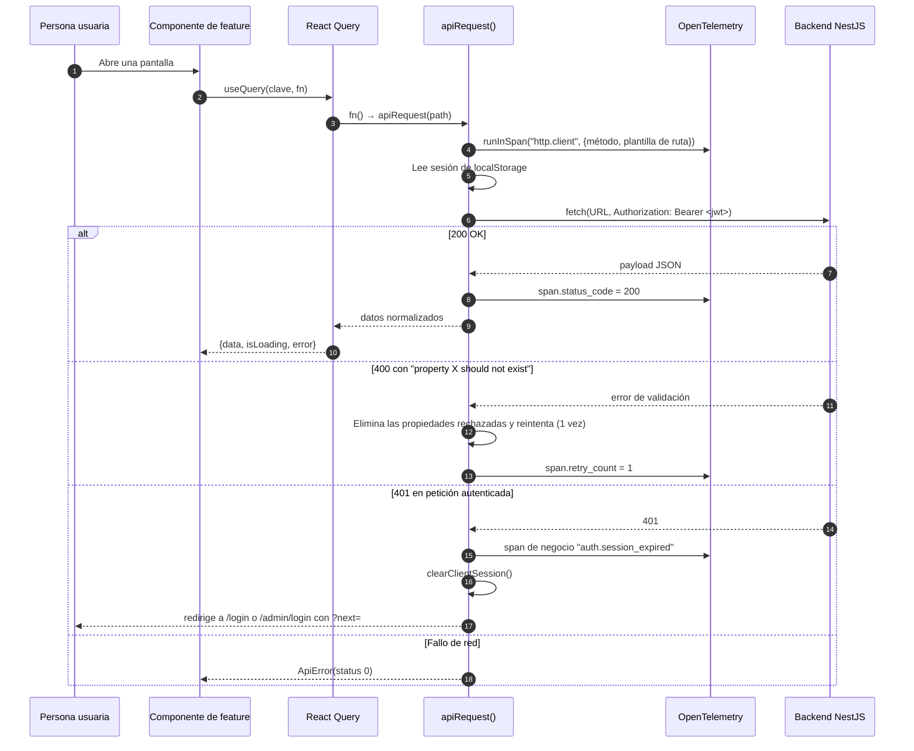
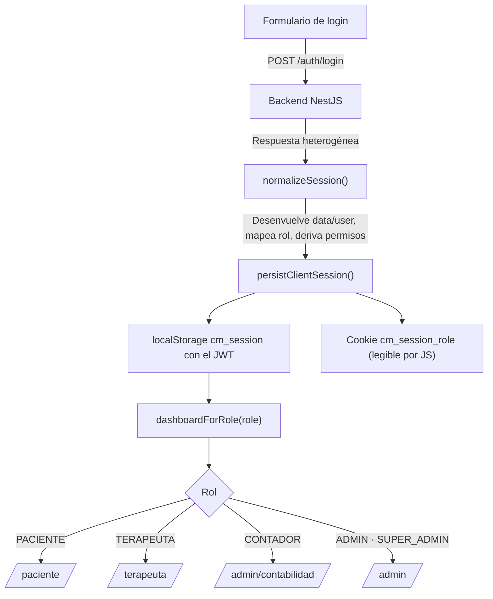

# Arquitectura — visión general

- **Fecha de evidencia:** 2026-08-03
- **Naturaleza:** `DOCUMENTAL`

---

## 1. En una frase

Corazón Migrante es una **aplicación Next.js 15 (App Router) exportada como HTML estático**, servida por Cloudflare Pages, que consume un backend NestJS en `/api/v1` mediante `fetch` autenticado con JWT desde el navegador.

Esa frase contiene la decisión que condiciona todo lo demás: **no hay servidor de aplicación**. Ver [ADR-0002](../adr/ADR-0002-exportacion-estatica.md).

---

## 2. Consecuencias de `output: "export"`

`next.config.ts` declara `output: "export"`. Esto no es un detalle de despliegue: reescribe las reglas de qué puede y no puede hacer el frontend.

| Capacidad de Next.js | ¿Disponible aquí? | Sustituto real |
|---|---|---|
| Server Components con datos en servidor | ❌ | Todo el fetch ocurre en el navegador |
| `middleware.ts` | ❌ **No se ejecuta** | `ClientRoleGuard` en los layouts |
| Route Handlers (`app/api/*`) | ❌ No se exportan | Cloudflare Pages Function (`functions/otel/v1/traces.ts`) |
| `headers()` en `next.config.ts` | ❌ | [public/_headers](../../public/_headers) que lee Cloudflare Pages |
| SSR / ISR / streaming en servidor | ❌ | Prerenderizado en build + hidratación |
| `next/image` con optimización | ❌ | `images.unoptimized: true` + `SmartImage` propio |
| Cookies `HttpOnly` emitidas por el frontend | ❌ | `localStorage` + cookie de rol legible por JS |

**Corolario de seguridad, explícito:** el HTML de `/admin`, `/paciente` y `/terapeuta` es un archivo estático público. Cualquiera puede descargarlo sin sesión. Lo único que protege los **datos** es el backend validando el JWT en cada endpoint. Ver [security/threat-model.md](../security/threat-model.md).

---

## 3. Capas

```
┌─────────────────────────────────────────────────────────┐
│  src/app/            Rutas, layouts, fronteras de error  │
│                      Composición fina; sin lógica de     │
│                      negocio ni llamadas HTTP directas   │
├─────────────────────────────────────────────────────────┤
│  src/features/       17 dominios de negocio              │
│                      UI de dominio + cliente *.api.ts    │
├─────────────────────────────────────────────────────────┤
│  src/shared/         ui/ · api/ · auth/ · hooks/         │
│  src/observability/  Telemetría transversal              │
│  src/config/         env.ts validado con zod             │
└─────────────────────────────────────────────────────────┘
                    ↓ dependencias solo hacia abajo
```

**Regla verificada:** la dirección `app → features → shared` se respeta; no hay ciclos entre capas.

Sí existe **un ciclo dentro de la capa transversal** —barril de `observability` ↔ `use-session`— detectado al refrescar el grafo sobre el árbol de trabajo completo. Funciona hoy y está analizado en [module-dependencies.md](module-dependencies.md) como `ARCH-01`.

`src/app/` es deliberadamente delgada: la mayoría de los `page.tsx` importan un componente de feature, un `PageHeader` y poco más. Esa disciplina es la que permite documentar el producto por features en vez de por rutas.

---

## 4. Flujo de una petición de datos



Detalle en [data-flow.md](data-flow.md) e [integrations/backend-api.md](../integrations/backend-api.md).

---

## 5. Estado

Cuatro tipos de estado, deliberadamente separados:

| Tipo | Mecanismo | Ejemplo |
|---|---|---|
| **Servidor** | React Query (`retry: 1`, `staleTime: 30 s`) | Listado de citas, usuarios, contador de no leídas |
| **Cliente global** | React Context | Sesión, toasts, confirmaciones, tutorial activo |
| **URL** | `searchParams` | `/noticias/detalle?…`, `?next=` tras el login |
| **Formulario** | `react-hook-form` + resolver `zod` | Login, registro, perfiles, reservas |

Ver [state-management.md](state-management.md) y [data-and-state/](../data-and-state/server-state.md).

---

## 6. Autenticación y autorización



Cinco roles: `PACIENTE`, `TERAPEUTA`, `ADMIN`, `SUPER_ADMIN`, `CONTADOR`. Doce permisos derivados del rol mediante `ROLE_PERMISSIONS`.

**Los permisos del cliente son informativos.** `normalizeSession()` los deriva del rol localmente y **descarta los que envíe el backend**. Sirven para decidir qué botón se muestra, nunca para autorizar. Ver [security/session-and-tokens.md](../security/session-and-tokens.md).

---

## 7. Observabilidad

Módulo propio de 28 archivos sobre OpenTelemetry Web SDK:

- **Trazas** de navegación, carga de documento, `fetch` y spans de negocio.
- **Saneado en dos capas**: `apiRouteTemplate()` descarta la query string al construir el atributo, y `SanitizingSpanProcessor` vuelve a comprobar antes de exportar.
- **Exportación** por OTLP HTTP a `/otel/v1/traces` (mismo origen, cubierto por `connect-src 'self'`).
- **Web Vitals** vía `use-web-vitals.ts`.

Ver [observability/](../observability/frontend/01-architecture-design.md) y [../observability/error-reporting.md](../observability/error-reporting.md).

---

## 8. Riesgos arquitectónicos abiertos

| Riesgo | Severidad | Detalle |
|---|---|---|
| El JWT viaja en la *query string* del stream SSE de notificaciones | **CRITICAL** | `?token=<jwt>`; las URLs quedan en logs de proxies e historial. Brecha `SEC-01` |
| Token en `localStorage` | HIGH | Accesible a cualquier script; sin `HttpOnly` posible en export estático. Brecha `SEC-03` |
| `middleware.ts` y `ClientRoleGuard` no alineados en `/admin` | MEDIUM | `TERAPEUTA` sobra en el middleware. Brecha `SEC-02` |
| CSP con `unsafe-inline` y `unsafe-eval`, `connect-src https:` | MEDIUM | Documentado en `_headers` con su propio `PENDIENTE_CM_CSP_CONNECT_SRC` |
| Variables de entorno de CI con nombres obsoletos | HIGH | CI define `NEXT_PUBLIC_API_URL`; el esquema valida `NEXT_PUBLIC_API_BASE_URL`. Brecha `OPS-01` |
| Sin prueba automatizada de los journeys críticos de negocio | HIGH | Brecha `TEST-01` |

Todos están registrados con impacto y propuesta en [reports/documentation-gap-analysis.md](../reports/documentation-gap-analysis.md). **Ninguno se corrige en este plan**: todos son `CAMBIO DE PRODUCTO`.

---

## Índice de arquitectura

- [system-context.md](system-context.md) — Contexto C4 nivel 1
- [containers.md](containers.md) — Contenedores C4 nivel 2
- [frontend-layers.md](frontend-layers.md) — Capas y límites internos
- [module-dependencies.md](module-dependencies.md) — Dependencias y centralidad
- [rendering-strategy.md](rendering-strategy.md) — Exportación estática, RSC y hidratación
- [routing-and-navigation.md](routing-and-navigation.md) — Rutas, guards y redirecciones
- [state-management.md](state-management.md) — Los cuatro tipos de estado
- [data-flow.md](data-flow.md) — Recorrido del dato
- [error-boundaries.md](error-boundaries.md) — Manejo de errores
- [integration-map.md](integration-map.md) — Integraciones externas
