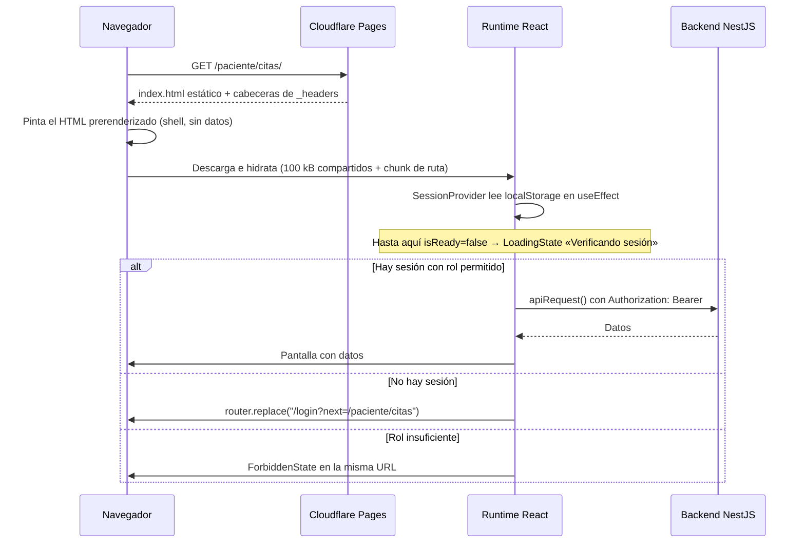

# Estrategia de renderizado

- **Fecha de evidencia:** 2026-08-03
- **Evidencia primaria:** [next.config.ts](../../next.config.ts), salida de `next build`, contenido de `out/`

---

## 1. Modo de salida

```ts
// next.config.ts
const nextConfig: NextConfig = {
  output: "export",
  trailingSlash: true,
  poweredByHeader: false,
  reactStrictMode: true,
  outputFileTracingRoot: projectRoot,
  eslint: { ignoreDuringBuilds: false },
  images: { unoptimized: true },
};
```

| Opción | Efecto real |
|---|---|
| `output: "export"` | El build produce HTML/CSS/JS estático en `out/`. No hay servidor Next.js en producción |
| `trailingSlash: true` | Las URLs terminan en `/`; cada ruta se materializa como `ruta/index.html` |
| `poweredByHeader: false` | Se elimina la cabecera `X-Powered-By` |
| `reactStrictMode: true` | Doble render en desarrollo para detectar efectos impuros |
| `outputFileTracingRoot` | Fija la raíz del proyecto para que Next no la infiera desde un lockfile ajeno en un directorio superior |
| `eslint.ignoreDuringBuilds: false` | **El lint bloquea el build.** Decisión deliberada del equipo, comentada en el propio archivo |
| `images.unoptimized: true` | Obligatorio con `export`: no hay servidor que optimice imágenes bajo demanda |

---

## 2. Clasificación real de las 69 rutas

De la salida de `next build`:

| Marca | Significado | Cantidad | Ejemplos |
|---|---|---:|---|
| `○ (Static)` | Prerenderizada en build como contenido estático | **64** | `/login`, `/admin/usuarios`, `/paciente/citas` |
| `● (SSG)` | Prerenderizada usando `generateStaticParams` | **1** | `/[slug]` → genera `/inicio` |
| `ƒ (Dynamic)` | Declarada como servida bajo demanda | **2** | `/api/debug-log`, `/api/otel/traces` |

### Las dos rutas `ƒ` no llegan a producción

Verificación empírica tras `yarn build`:

```
$ ls out/api
ls: cannot access 'out/api': No such file or directory
```

`output: "export"` no materializa Route Handlers. Consecuencias concretas:

- **`/api/debug-log`** — solo existe con `next dev`. `client.ts` lo protege explícitamente: la llamada se emite únicamente si `process.env.NODE_ENV === "development"`. El comentario del código explica el porqué: sin esa guarda, el navegador reportaría un `405` en consola en **cada** llamada a la API en producción.
- **`/api/otel/traces`** — en producción lo sustituye la Cloudflare Pages Function [functions/otel/v1/traces.ts](../../functions/otel/v1/traces.ts), que responde en `/otel/v1/traces`.

---

## 3. Server Components y Client Components

El App Router de Next.js 15 hace que los componentes sean **Server Components por defecto**. Con `output: "export"` eso significa «se ejecutan **en tiempo de build**», no en tiempo de petición.

| Frontera | Archivos | Momento de ejecución |
|---|---|---|
| Server Component (por defecto) | La mayoría de `page.tsx` y `layout.tsx`: definen `metadata` y componen | **En build** |
| Client Component (`"use client"`) | `providers.tsx`, `guard.tsx`, `use-session.tsx`, todos los componentes con estado o efectos | En el navegador, tras hidratar |

`generateStaticParams()` en `/[slug]` también corre **en build**: llama a `listCmsPages()` contra el backend en ese momento. Si el CMS cambia después, la lista de rutas prerenderizadas **no se actualiza hasta el siguiente build**. Es una característica del modelo elegido, no un fallo — y la razón por la que `/[slug]` incluye `FALLBACK_PUBLIC_SLUGS`.

---

## 4. Ciclo de vida en el navegador



**Nota sobre hidratación:** `SessionProvider` lee `localStorage` dentro de un `useEffect`, no en un inicializador de `useState`. Es obligatorio: el HTML se generó en build, donde `window` no existe; leer `localStorage` durante el primer render provocaría un *mismatch* de hidratación. El código lo documenta y añade un `eslint-disable` justificado.

---

## 5. Tipografías

[app/layout.tsx](../../src/app/layout.tsx) carga **Fraunces** (display) y **Manrope** (cuerpo) con `next/font/google`.

Ambas son **fuentes variables** y no declaran `weight`: se descarga un único archivo que cubre todo el rango de grosores. El comentario del código cuantifica la mejora: antes eran «5 pesos × 2 estilos = 10 descargas solo para los títulos».

`display: "swap"` en ambas evita texto invisible durante la carga (FOIT), a costa de un posible desplazamiento (FOUT). Ver [performance/images-and-fonts.md](../performance/images-and-fonts.md).

---

## 6. Imágenes

Con `images.unoptimized: true` no hay optimización de Next.js. La aplicación usa [SmartImage](../../src/shared/ui/smart-image.tsx), que valida el `src` antes de renderizar (`isValidSrc()`), y sirve los medios desde **Cloudinary**. Ver [performance/images-and-fonts.md](../performance/images-and-fonts.md) y [docs/CLOUDINARY-ASSETS.md](../CLOUDINARY-ASSETS.md).

---

## 7. Qué habría que cambiar para migrar a despliegue con servidor

Registrado como escenario, **no como propuesta activa**:

1. Retirar `output: "export"` de `next.config.ts`.
2. `middleware.ts` empezaría a ejecutarse — y con él la divergencia de roles de `/admin` descrita en [routes/route-catalog.md §8](../routes/route-catalog.md) se volvería relevante.
3. Las reglas de [public/_headers](../../public/_headers) tendrían que migrarse a `headers()` en `next.config.ts`; Cloudflare Pages dejaría de leer ese archivo.
4. Los Route Handlers `/api/*` pasarían a existir, duplicando a la Pages Function de telemetría.
5. Habría que reevaluar `images.unoptimized`.

Cualquiera de esos pasos es `CAMBIO DE PRODUCTO` con impacto en seguridad y rendimiento, y exige nueva línea base. Ver [ADR-0002](../adr/ADR-0002-exportacion-estatica.md).
