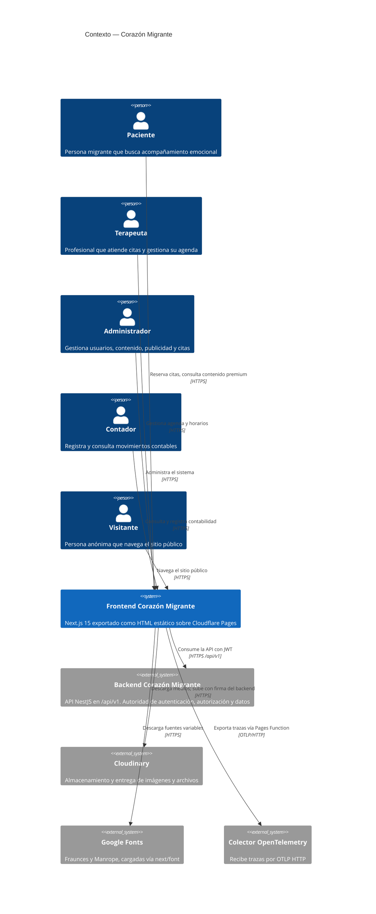
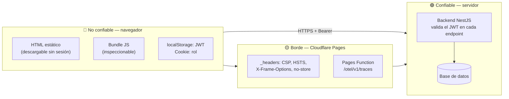

# Contexto del sistema (C4 nivel 1)

- **Fecha de evidencia:** 2026-08-03
- **Fuente oficial del modelo:** [structurizr/workspace.dsl](../../structurizr/workspace.dsl)

---

## 1. Diagrama de contexto

---

## 2. Actores

| Actor | Rol técnico | Punto de entrada | Portal |
|---|---|---|---|
| Visitante | — (sin sesión) | `/` | Sitio público |
| Paciente | `PACIENTE` | `/login` | `/paciente` |
| Terapeuta | `TERAPEUTA` | `/admin/login` | `/terapeuta` |
| Administrador | `ADMIN`, `SUPER_ADMIN` | `/admin/login` | `/admin` |
| Contador | `CONTADOR` | `/admin/login` | `/admin/contabilidad` |

Detalle de permisos en [business/actors-and-roles.md](../business/actors-and-roles.md).

---

## 3. Sistemas externos

### Backend NestJS — `/api/v1`

**La autoridad del sistema.** El frontend no toma ninguna decisión de seguridad que el backend no pueda revocar.

- Configurado por `NEXT_PUBLIC_API_BASE_URL` (validada como URL por zod en [config/env.ts](../../src/config/env.ts)).
- Sin ella, `apiBaseUrl()` lanza `ApiError(…, 500)` en la primera llamada.
- El cliente normaliza la base: si alguien deja `https://dominio/api/v1`, el sufijo se recorta para evitar `/api/v1/api/v1/...`.
- En desarrollo detecta y rechaza que la variable apunte al propio frontend.

Mapa completo en [integrations/backend-api.md](../integrations/backend-api.md).

### Cloudinary

Entrega de imágenes y archivos. Las URLs concretas llegan por más de una docena de variables `NEXT_PUBLIC_FILE_SERVER_*`. La subida usa **firma emitida por el backend** (`/files/cloudinary/signature` → `/files/cloudinary/complete`): el frontend nunca posee credenciales de Cloudinary.

Ver [integrations/file-storage.md](../integrations/file-storage.md) y [CLOUDINARY-ASSETS.md](../CLOUDINARY-ASSETS.md).

### Google Fonts

Fraunces y Manrope vía `next/font/google`, que las descarga **en build** y las sirve desde el propio origen. La CSP mantiene `fonts.googleapis.com` y `fonts.gstatic.com` permitidos en `style-src` y `font-src`.

### Colector OpenTelemetry

Las trazas se exportan por OTLP HTTP a `/otel/v1/traces` — **mismo origen**, atendido por la Cloudflare Pages Function [functions/otel/v1/traces.ts](../../functions/otel/v1/traces.ts), que reenvía al colector. Configuración de referencia en [infra/otel-collector/](../../infra/otel-collector/).

Que el destino sea el mismo origen es lo que permite que la CSP no necesite abrir `connect-src` a ningún host externo por telemetría.

---

## 4. Fronteras de confianza

**Regla que gobierna todo el frontend:** nada dentro de la frontera roja es una medida de seguridad. Ocultar un botón, comprobar un rol en el guard o derivar permisos en el cliente son decisiones de **experiencia de uso**. La autorización real ocurre en verde.

Modelo de amenazas completo en [security/threat-model.md](../security/threat-model.md).
