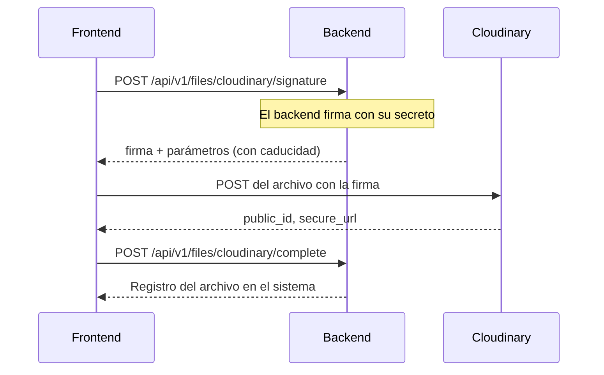

# Almacenamiento de archivos (Cloudinary)

- **Fecha de evidencia:** 2026-08-03
- **Evidencia:** [shared/api/files.ts](../../src/shared/api/files.ts), `ENDPOINTS.files`

## 1. Modelo

Cloudinary sirve **lectura** directa desde el navegador y **escritura** mediante firma emitida por el backend.

> **El frontend nunca posee credenciales de Cloudinary.** Es la propiedad de seguridad central de esta integración.

## 2. Lectura

Las URLs llegan por **15+ variables** `NEXT_PUBLIC_FILE_SERVER_*`: logo, imagen de autenticación, héroes de landing y editorial, imágenes temáticas (terapia, familia, biblioteca), catálogos (especialidades, profesiones, países/ciudades, ocupaciones, síntomas, objetivos terapéuticos) y fotos de dos especialistas.

Todas se validan como URL con zod (`optionalUrl`), y una cadena vacía se convierte en `undefined` para que `SmartImage` aplique su respaldo. Ver [../operations/configuration.md](../operations/configuration.md).

`SmartImage` protege el render: `isValidSrc()` rechaza `null`, `undefined`, `about:blank` y cadenas vacías, y el fallback se intenta **una sola vez**.

## 3. Escritura — flujo firmado



Endpoints implicados:

| Operación | Endpoint | Variante admin |
|---|---|---|
| Firma | `/files/cloudinary/signature` | `/admin/files/cloudinary/signature` |
| Confirmación | `/files/cloudinary/complete` | `/admin/files/cloudinary/complete` |
| Subida directa al backend | `/files` | `/admin/files` |
| URL firmada de descarga | `/files/:fileId/signed-url` | — |
| Descarga | `/files/:fileId/download` | — |
| Administración | — | `/admin/files`, `/admin/files/:fileId` |

## 4. Por qué el flujo firmado es correcto

| Alternativa | Problema |
|---|---|
| Preset de subida sin firmar | Cualquiera podría subir a la cuenta de Cloudinary |
| API secret en el frontend | Sería público — el bundle es inspeccionable |
| **Firma emitida por el backend** (elegida) | El secreto no sale del servidor; la firma caduca |

La firma acota **qué** se puede subir y **durante cuánto tiempo**, y el paso de confirmación permite al backend registrar el archivo y aplicar sus propias reglas.

## 5. `FormData` en `apiRequest()`

Cuando el cuerpo es `FormData`, el cliente aplica tres excepciones deliberadas:

1. **No** fija `Content-Type` — el navegador debe añadir el `boundary` de multipart.
2. **No** aplica `pruneOptionalEmptyValues()`.
3. **No** reintenta ante un `400` con propiedades rechazadas.

Las tres son correctas: manipular un `FormData` en el cliente rompería la carga.

## 6. Consideraciones de seguridad

| Aspecto | Estado |
|---|---|
| Credenciales en el frontend | ✅ Ninguna |
| Validación de tipo y tamaño | ⚠️ **No verificada en el cliente**; debe hacerla el backend |
| Descarga de archivos privados | ✅ Mediante URL firmada (`/files/:fileId/signed-url`) |
| `img-src` en la CSP | `'self' data: blob: https:` — admite cualquier host HTTPS |
| Nombre de archivo en telemetría | No se registra |

Sobre la segunda fila: aunque el frontend valide tipo y tamaño, **es una comprobación de experiencia, no de seguridad**. La autoridad es el backend, coherente con el principio general de [../security/frontend-security.md](../security/frontend-security.md).

## 7. Rendimiento

Cloudinary admite transformaciones en la URL (`f_auto,q_auto` para formato y calidad automáticos). **No se ha verificado** que las URLs configuradas las usen.

Es la optimización de mejor relación impacto/esfuerzo de todo el proyecto: **es configuración, no código**, y afecta a la ruta más pesada y más visitada. Brecha `PERF-04`. Ver [../performance/images-and-fonts.md](../performance/images-and-fonts.md).

## 8. Herramienta disponible

```bash
node scripts/audit-media-assets.mjs
```

Audita los assets de medios. Ver también [../CLOUDINARY-ASSETS.md](../CLOUDINARY-ASSETS.md), documento preexistente del equipo que registra casos concretos de imágenes que no cargaban.
