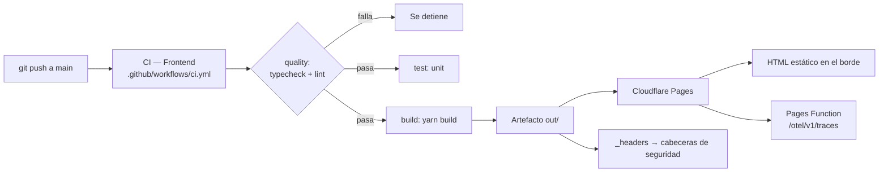

# Despliegue

- **Fecha de evidencia:** 2026-08-03

## 1. Modelo



## 2. Artefacto

`yarn build` (`next build` con `output: "export"`) produce **`out/`**:

```
out/
├── _headers                cabeceras de seguridad (¡crítico!)
├── _next/static/           bundles con hash
├── index.html · 404.html
├── admin/ paciente/ terapeuta/     portales (HTML público)
├── biblioteca/ booking/ cursos/ login/ noticias/ novedades/
├── inicio/ privacidad/ registro/ terminos/ 403/
├── favicon.ico · icon.svg · manifest.webmanifest
└── robots.txt · sitemap.xml
```

**No existe `out/api/`.** Los Route Handlers no se exportan. Ver [../architecture/rendering-strategy.md](../architecture/rendering-strategy.md).

## 3. Verificaciones antes de publicar

| # | Comprobación | Comando |
|---:|---|---|
| 1 | Build limpio | `rm -rf .next out && yarn build` → exit 0 |
| 2 | **`_headers` en el artefacto** | `ls -la out/_headers` |
| 3 | Número de rutas esperado | 69 en la tabla del build |
| 4 | Presupuesto de bundle | Comparar con [../performance/budgets.md](../performance/budgets.md) |
| 5 | Calidad | `yarn test:ci` |

La comprobación 2 es la más importante y la más fácil de olvidar: si `_headers` no llega a `out/`, **la aplicación funciona con normalidad y desaparecen todas las cabeceras de seguridad**. Es un fallo silencioso.

## 4. Artefacto del pipeline — corregido

El pipeline subía **`.next/`**, que es el directorio intermedio de compilación. Con `output: "export"`, lo desplegable es **`out/`**. Ya se sube `out/` bajo el nombre `frontend-export`.

Brecha `OPS-02`: **cerrada**.

## 5. Variables de entorno de CI — corregidas

Estaban desalineadas con el esquema de `src/config/env.ts`:

| Definida antes en CI | Esperada por el esquema | Ahora |
|---|---|---|
| `NEXT_PUBLIC_API_URL` | `NEXT_PUBLIC_API_BASE_URL` | ✅ corregida |
| `NEXT_PUBLIC_PUBLIC_ASSETS_BASE_URL` | `NEXT_PUBLIC_FILE_SERVER_PUBLIC_ASSETS_BASE_URL` | ✅ corregida |
| `NEXT_PUBLIC_CLOUDINARY_CLOUD_NAME` | — (no existe) | ✅ eliminada |
| `NEXT_PUBLIC_CLOUDINARY_UPLOAD_PRESET` | — (no existe) | ✅ eliminada |
| `NEXT_PUBLIC_APP_URL` | `NEXT_PUBLIC_APP_URL` | ✅ ya era correcta |

**Cuatro de cinco eran obsoletas o inexistentes.** El build pasaba igualmente porque el esquema aplica valores por defecto y las marca opcionales: **CI llevaba tiempo construyendo sin API configurada y nadie lo detectaba**. Es el modo de fallo más insidioso de una configuración validada con tolerancia.

El bloque `env` lleva ahora un comentario que exige mantener los tres sitios sincronizados: `env.ts`, `.env.example` y el pipeline.

Brecha `OPS-01`: **cerrada**.

## 5.bis Verificación del artefacto — añadida

El pipeline comprueba ahora, antes de publicar:

```bash
test -f out/index.html || exit 1
test -f out/_headers   || exit 1   # sin esto el despliegue quedaría sin CSP, HSTS ni no-store
```

La segunda es la que importa: si `_headers` no llega a `out/`, **la aplicación funciona con total normalidad y desaparecen todas las cabeceras de seguridad**. Era el fallo más silencioso del despliegue y no lo detectaba nada.

Brecha `OPS-03`: **cerrada** en su parte de pipeline. El smoke contra el dominio ya publicado sigue siendo manual.

## 5.ter Auditoría de dependencias — añadida

Job `audit` con `yarn npm audit --severity high --recursive`, **en modo informativo** (`continue-on-error: true`): la Fase 17 del plan prohíbe hacer fallar el pipeline por deuda preexistente sin una estrategia de adopción acordada.

Ejecutado localmente, ya expone hallazgos reales (por ejemplo `undici` con severidad alta, transitiva vía `node-gyp`). Brecha `DEP-01`: **cerrada** en cuanto a visibilidad.

## 6. Configuración de Cloudflare Pages

| Ajuste | Valor |
|---|---|
| Comando de build | `yarn build` |
| Directorio de salida | **`out`** |
| Versión de Node | ≥ 20.18.0 (CI usa 22) |
| Functions | `functions/` → `/otel/v1/traces` |
| Variables de entorno | Todas las `NEXT_PUBLIC_*` necesarias |

⚠️ Las variables `NEXT_PUBLIC_*` se **incrustan en el bundle en tiempo de build**. Cambiar una exige **reconstruir**: no basta con editarla en el panel y reiniciar. Es la causa más común de «cambié la variable y no pasó nada».

## 7. Smoke posterior al despliegue

```bash
curl -sI https://DOMINIO/ | grep -iE 'content-security|strict-transport|x-frame'
curl -sI https://DOMINIO/admin/ | grep -iE 'x-robots|cache-control'
curl -s  https://DOMINIO/robots.txt
curl -s  https://DOMINIO/sitemap.xml | head -5
```

Y en el navegador: cargar `/`, iniciar sesión, comprobar que una pantalla con datos carga (valida `NEXT_PUBLIC_API_BASE_URL` y la CSP a la vez).

**No hay smoke automatizado tras el despliegue.** Brecha `OPS-03`.

## 8. Rollback

Ver [rollback.md](rollback.md). Cloudflare Pages conserva los despliegues anteriores: volver a uno es inmediato y no requiere reconstruir.
