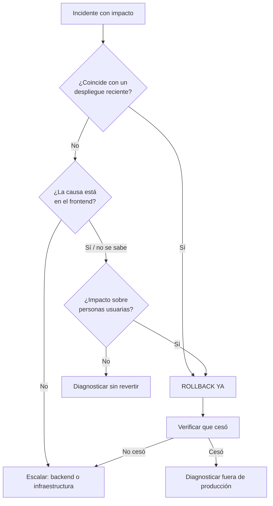

# Rollback

- **Fecha de evidencia:** 2026-08-03

## 1. Estrategia

**Cloudflare Pages conserva los despliegues anteriores.** Volver a uno es inmediato y no requiere reconstruir. Es la herramienta de contención principal de casi todos los incidentes del frontend.

Procedimiento operativo completo en [runbooks/rollback-de-release.md](runbooks/rollback-de-release.md).

## 2. Qué revierte y qué no

| Elemento | ¿Lo revierte el rollback? |
|---|---|
| Código de la aplicación | ✅ |
| Bundles y chunks | ✅ |
| `public/_headers` (CSP y cabeceras) | ✅ — viaja dentro del artefacto |
| Pages Function de telemetría | ✅ |
| **Variables de entorno del panel** | ❌ — persisten |
| Cambios en el backend | ❌ |
| Datos ya modificados | ❌ |
| Trazas ya exportadas | ❌ |

La fila crítica es la de variables de entorno: revertir el código dejando una variable nueva produce una combinación que nunca se ha probado.

## 3. Criterio de decisión

## 4. Reversión de los cambios documentales

Este plan de documentación es aditivo y confinado. Su reversión selectiva está descrita en [../reports/baseline.md §7](../reports/baseline.md) y **no toca `src/`, `tests/`, `package.json` ni `yarn.lock`**.

## 5. Ventana de retención

Depende de la configuración de Cloudflare Pages y **no está documentada en el repositorio**. Conviene conocerla antes de necesitarla: define cuánto atrás se puede revertir.

Registrado dentro de `OPS-05`.
