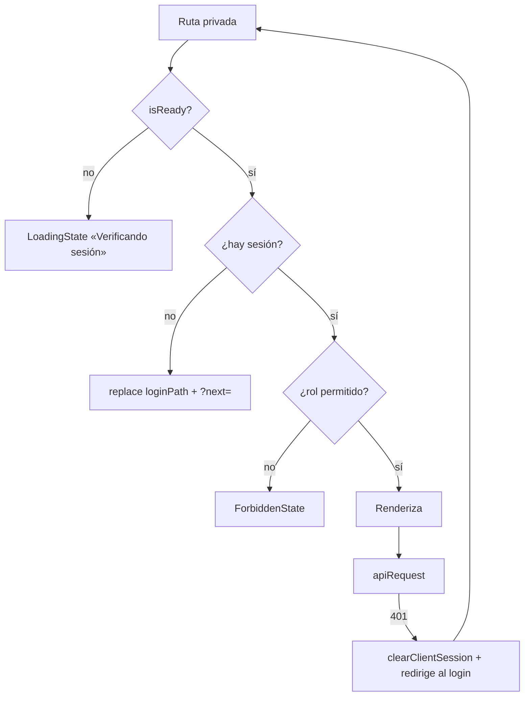

# Runbook — Autenticación en bucle

## Síntoma

Tras iniciar sesión correctamente, la aplicación devuelve al login una y otra vez. O una pantalla privada parpadea entre «Verificando sesión» y el formulario de acceso.

## Impacto

**Bloqueo total** para la persona afectada. Si es generalizado, la aplicación es inutilizable.

## Cadena de decisiones implicada



El bucle se produce cuando el paso J se repite: se obtiene sesión, se pide datos, llega `401`, se limpia la sesión, se vuelve al login.

## Diagnóstico seguro

En la consola del navegador (⚠️ **no compartir el token en ningún informe**):

```js
// ¿Existe la sesión?
Boolean(localStorage.getItem("cm_session"))

// ¿Qué rol tiene? (sin exponer el token)
JSON.parse(localStorage.getItem("cm_session") ?? "{}").role

// ¿Cuándo caduca el token?
const t = JSON.parse(localStorage.getItem("cm_session") ?? "{}").token;
t && new Date(JSON.parse(atob(t.split(".")[1].replace(/-/g,"+").replace(/_/g,"/"))).exp * 1000)
```

En la pestaña Network: buscar peticiones a `/api/v1/*` con respuesta `401`.

## Causas por orden de probabilidad

| # | Causa | Indicio | Solución |
|---:|---|---|---|
| 1 | **El backend rechaza el token** (firma, emisor o expiración) | `401` inmediato en la primera petición | Corresponde al backend |
| 2 | Reloj del cliente desfasado | La fecha de `exp` parece futura pero `readTokenExpiry` la considera pasada | Sincronizar el reloj del sistema |
| 3 | El login devuelve una respuesta sin token | Sesión presente, `token` ausente | `token` es **opcional** en `sessionSchema`: la sesión se crea sin él y toda petición da `401` |
| 4 | `NEXT_PUBLIC_API_BASE_URL` apunta a un backend distinto del que emitió el token | `401` en todo | Corregir la variable y **reconstruir** |
| 5 | Rol no contemplado por el guard | `ForbiddenState`, no bucle | Ver [../../routes/route-catalog.md §8](../../routes/route-catalog.md) |

**La causa 3 merece atención especial.** `sessionSchema` declara `token: z.string().min(1).optional()`. Si el backend cambia el nombre del campo y `normalizeSession()` no lo reconoce, se crea una sesión **válida sin token**: el guard deja pasar, y cada petición devuelve `401` y expulsa. Es exactamente el bucle observado, y no produce ningún error en el login.

## Evidencia a recoger

- Rol y presencia de token (nunca el token).
- Código de estado y cuerpo de la respuesta del login.
- Códigos de estado de las peticiones posteriores.
- Valor de `NEXT_PUBLIC_API_BASE_URL` en el entorno afectado.
- Trazas: frecuencia del span `auth.session_expired` (indicador directo del bucle).

## Mitigación

**Para la persona afectada:**
```js
localStorage.removeItem("cm_session");
document.cookie = "cm_session_role=; max-age=0; path=/";
```
y volver a iniciar sesión.

**Si es generalizado:** rollback al despliegue anterior y verificar con el equipo de backend si cambió el formato de la respuesta de login o la clave de firma.

## Rollback

Volver al despliegue anterior en Cloudflare Pages. Si la causa está en el backend, el rollback del frontend no resuelve nada.

## Prevención

1. Cubrir con prueba el flujo de login (brecha `TEST-01`).
2. Alertar sobre el span `auth.session_expired`: un pico es la señal más temprana de este incidente.
3. Considerar exigir `token` en `sessionSchema` — convertiría el fallo silencioso en un error visible en el login. Sería `CAMBIO DE PRODUCTO`.

## Escalado

Requiere al equipo de backend en las causas 1 y 3. Contacto sin definir en el repositorio (`OPS-05`).
