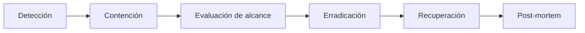

# Respuesta a incidentes de seguridad

- **Fecha de evidencia:** 2026-08-03
- **Alcance:** incidentes cuya causa o superficie está en el frontend.

> **Limitación declarada:** este proyecto **no tiene** roles de guardia definidos, canal de escalado formal ni acuerdo de nivel de servicio documentado en el repositorio. Este documento define el **procedimiento técnico**; la cadena de mando debe fijarla la organización. Brecha `OPS-05`.

---

## 1. Clasificación

| Nivel | Definición | Ejemplo | Reacción |
|---|---|---|---|
| **P1** | Exposición activa de datos personales o de sesión | JWT filtrándose a un tercero; XSS explotado | Inmediata |
| **P2** | Vulnerabilidad explotable sin exposición confirmada | Dependencia con CVE crítico en producción | < 24 h |
| **P3** | Debilidad sin explotación conocida | CSP demasiado permisiva | Siguiente ciclo |
| **P4** | Mejora defensiva | Añadir auditoría de dependencias | Backlog |

---

## 2. Procedimiento general

### Contención — la herramienta principal es el rollback

Con Cloudflare Pages, **volver al despliegue anterior es la contención más rápida** y no requiere reconstruir. Ver [operations/rollback.md](../operations/rollback.md).

### Evaluación de alcance — qué preguntar

1. ¿Se comprometieron tokens de sesión? → Si sí, **el backend debe invalidarlos**: el frontend no puede revocar un JWT.
2. ¿Se expusieron datos de pacientes? → Notificación regulatoria; decisión del responsable legal.
3. ¿Afecta a todas las personas usuarias o a un subconjunto?
4. ¿Hay evidencia en las trazas del colector OTel?

---

## 3. Guías por tipo de incidente

### 3.1 Sospecha de robo de tokens de sesión

**Indicadores:** actividad desde ubicaciones inesperadas; picos del span `auth.session_expired`; informes de sesiones ajenas.

1. **Contener** — el backend invalida las sesiones afectadas o rota la clave de firma de JWT. *El frontend no puede hacerlo.*
2. Verificar si la vía fue `SEC-01` (token en la query string del SSE) revisando logs de acceso del backend y del proxy en busca de `?token=`.
3. Revisar si se introdujo algún script de terceros recientemente.
4. Forzar reautenticación de toda la base de usuarios si el alcance no puede acotarse.

**Nota:** `logout()` no llama a `POST /auth/logout`, así que **los tokens siguen siendo válidos hasta su expiración**. En un incidente, la invalidación tiene que venir del backend. Ver [session-and-tokens.md §6](session-and-tokens.md).

### 3.2 XSS confirmado

1. Rollback inmediato al despliegue anterior.
2. Identificar el punto de inyección: buscar `dangerouslySetInnerHTML` y todo render de contenido del CMS sin sanear.
3. Asumir que **todo `localStorage` quedó comprometido** — incluido el JWT de quienes visitaron la página.
4. Coordinar con el backend la invalidación de sesiones.
5. Endurecer la CSP eliminando `unsafe-inline` de `script-src`, si es viable.

### 3.3 Dependencia comprometida

1. `yarn why <paquete>` para determinar si es directa o transitiva y qué la arrastra.
2. Comprobar si entra en el bundle de producción o solo en desarrollo.
3. Si está en producción: rollback y fijar una versión segura en `resolutions`.
4. Regenerar `yarn.lock` **de forma controlada** y revisar el diff completo.
5. Rebuild y verificación completa según [governance/zero-regression-policy.md](../governance/zero-regression-policy.md).

### 3.4 Fuga de datos personales en telemetría

**Indicador:** aparición de nombres, correos o identificadores en atributos de span del colector.

1. Detener la exportación: `NEXT_PUBLIC_TELEMETRY_*` desactivado o rollback.
2. Purgar los datos afectados en el colector.
3. Identificar la capa que falló: ¿se añadió un atributo sin pasar por `ALLOWED_ATTRIBUTE_KEYS`? ¿Se registró una URL completa?
4. Añadir una prueba unitaria que reproduzca el caso en `tests/unit/observability/sanitize.test.ts`.

Que exista una lista blanca hace que este incidente sea improbable — pero también que, si ocurre, la causa sea siempre identificable: alguien amplió la lista.

### 3.5 Cabeceras de seguridad ausentes en producción

**Indicador:** `curl -I` no devuelve la CSP.

Causa habitual: `public/_headers` no llegó a `out/`. Verificar `ls out/_headers` tras el build. Es el fallo más silencioso del despliegue: la aplicación funciona con normalidad, solo desaparecen las defensas. Ver [operations/runbooks/faltan-cabeceras-seguridad.md](../operations/runbooks/faltan-cabeceras-seguridad.md).

---

## 4. Evidencia disponible durante un incidente

| Fuente | Contenido | Limitación |
|---|---|---|
| Trazas OTel | Rutas (como plantilla), códigos de estado, Web Vitals, spans de negocio | **Deliberadamente sin identidad de usuario** — no permite rastrear a una persona concreta |
| Logs de Cloudflare Pages | Peticiones al artefacto estático | Fuera del repositorio |
| Logs del backend | Autenticación y autorización reales | Fuera del alcance del frontend |
| `logs/api-requests.log` | Peticiones y respuestas | **Solo en desarrollo local** |
| Historial de git | Qué cambió y cuándo | — |

**Tensión honesta:** el saneado que protege la privacidad en el día a día **reduce la capacidad forense** durante un incidente. Es una decisión correcta —proteger a las personas usuarias por defecto—, pero conviene saberlo antes de necesitarlo: la investigación de un incidente de acceso dependerá casi por completo de los logs del backend.

---

## 5. Post-mortem

Toda incidencia P1 o P2 debe producir:

1. Cronología con horas.
2. Causa raíz (técnica y de proceso).
3. Alcance: datos y personas afectadas.
4. Acciones correctivas con responsable y fecha.
5. **Actualización de [threat-model.md](threat-model.md)** si aparece un vector no contemplado.
6. Prueba automatizada que impida la reaparición, cuando sea posible.

Sin culpabilización: el objetivo es el sistema, no la persona.

---

## 6. Contactos

| Rol | Responsable | Canal |
|---|---|---|
| Propietario del frontend | Ver [governance/ownership.md](../governance/ownership.md) | — |
| Propietario del backend | **Sin definir en el repositorio** | — |
| Responsable legal / protección de datos | **Sin definir en el repositorio** | — |
| Operación de Cloudflare | **Sin definir en el repositorio** | — |

**Estas tres ausencias son reales y bloquean una respuesta P1 eficaz.** Ninguna se puede resolver desde el código: requieren una decisión organizativa. Registradas como `OPS-05`, severidad **HIGH**.
