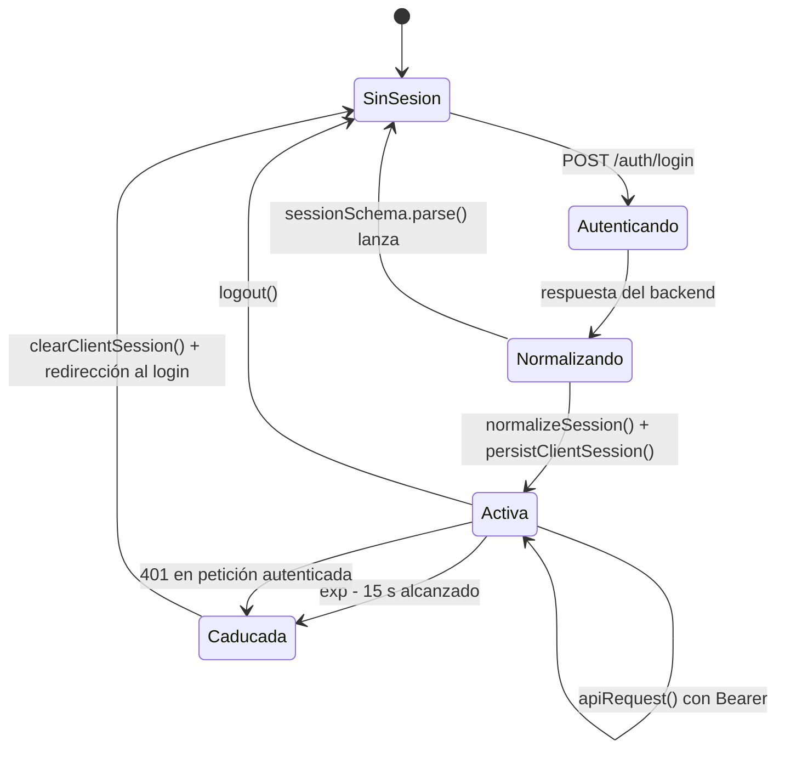

# Sesión y tokens

- **Fecha de evidencia:** 2026-08-03
- **Evidencia:** [shared/auth/session.ts](../../src/shared/auth/session.ts), [cookies.ts](../../src/shared/auth/cookies.ts), [use-session.tsx](../../src/shared/auth/use-session.tsx)

---

## 1. Ciclo de vida



---

## 2. Forma de la sesión

```ts
const sessionSchema = z.object({
  userId:      z.string().min(1),
  fullName:    z.string().min(1),
  email:       z.string().email(),
  role:        z.enum(ROLES),
  permissions: z.array(z.enum([...12 permisos])),
  token:       z.string().min(1).optional()
});
```

`token` es **opcional** en el esquema. Una sesión sin token es sintácticamente válida, pero toda petición autenticada fallará con `401`. Es una tolerancia deliberada ante backends que devuelvan el token por otra vía.

`sessionSchema.parse()` **lanza** si algo falta: es preferible fallar en el login a arrastrar una sesión incompleta.

---

## 3. `normalizeSession()` — absorción de variabilidad

El backend no devuelve siempre la misma forma. La función cubre:

| Variación | Tratamiento |
|---|---|
| `{data: {...}}` anidado | `unwrapSessionInput()` recursivo |
| `{user: {...}}` | Se extrae `user` |
| Respuesta plana | Se usa tal cual |
| Token en `token`, `access_token` o `accessToken` | Se prueban los tres, **incluido el caso en que el token vive en el envoltorio externo mientras los datos de usuario están en `data`** |
| Rol en `role`, `rol` o `roles[]` | Se recorren todos los candidatos |
| Roles de servicio | `PATIENT→PACIENTE`, `THERAPIST→TERAPEUTA`, `ACCOUNTANT→CONTADOR` |
| Banderas heredadas | `is_super_admin`, `is_accounter`, `is_admin`, `is_terapeuta` |
| Nombre en `full_name`, `nombre`, `name` o `firstName`+`lastName` | Cascada de fallbacks |

**Rol por defecto: `PACIENTE`.** Si nada permite deducir el rol, se asume el de menor privilegio. Es la elección correcta: fallar hacia el mínimo privilegio.

**Los permisos se derivan del rol y se ignoran los del backend:**

```ts
const permissions: Permission[] = ROLE_PERMISSIONS[role];
```

Consecuencia documentada: un permiso concedido individualmente en el backend no será visible en la interfaz. Coherente con que los permisos del cliente sean solo para pintar.

---

## 4. Persistencia

| Dato | Almacén | Atributos |
|---|---|---|
| Sesión completa (con el JWT) | `localStorage["cm_session"]` | Ninguno — accesible a todo script del origen |
| Rol | Cookie `cm_session_role` | `path=/; SameSite=Lax` + `Secure` **solo en HTTPS** |

`roleCookieAttributes()` añade `Secure` únicamente si `window.location.protocol === "https:"`. El motivo está en el código: en `http://localhost` el navegador descartaría la cookie y el desarrollo local quedaría sin sesión.

La cookie **no es `HttpOnly` a propósito**: `middleware.ts` la leería en un despliegue con servidor, y en el actual la escribe JavaScript. **No contiene el token**, solo el rol — que no es un secreto (ver amenaza S3 en [threat-model.md](threat-model.md)).

---

## 5. Expiración

Dos mecanismos independientes:

**a) Proactivo, al leer.** `readClientSession()` invoca `isSessionExpired()`, que decodifica el `exp` del JWT con un margen (`EXPIRY_SKEW_MS = 15 000`). Si ya caducó, **limpia el almacenamiento y devuelve `null`** — no deja un token muerto ni lo envía en las siguientes peticiones.

**b) Reactivo, ante `401`.** `handleUnauthorizedSession()` emite el span `auth.session_expired`, limpia la sesión y redirige al login apropiado con `?next=`.

El margen de 15 s evita lanzar una petición que el backend va a rechazar justo en el borde.

---

## 6. Cierre de sesión

```ts
const logout = useCallback(() => {
  startSpan(BUSINESS_SPANS.authLogout, { feature: "auth", operation: "logout" }).end();
  clearClientSession();
  rotateTelemetrySessionId();
  setSessionState(null);
  setIsReady(true);
}, []);
```

`rotateTelemetrySessionId()` es un detalle de privacidad bien resuelto: sin él, las trazas de quien entre después en el mismo navegador (un equipo compartido en una consulta) se agruparían con las de quien acaba de salir.

**Lo que `logout()` no hace:** no llama a `POST /auth/logout`. El endpoint está declarado en `ENDPOINTS` pero no se invoca, de modo que **el JWT sigue siendo válido en el backend hasta su expiración natural**. Es aceptable para tokens de vida corta; con tokens largos, un token robado antes del cierre de sesión seguiría sirviendo. Registrado como observación, no como brecha bloqueante.

---

## 7. Ausencia de renovación de token

`ENDPOINTS.auth.refresh` (`/api/v1/auth/refresh`) está declarado pero **nunca se llama**. No hay refresh token ni renovación silenciosa.

**Consecuencia práctica:** cuando el JWT caduca, la sesión termina — se pierde el trabajo no guardado de un formulario largo. La experiencia está bien resuelta (redirección con `?next=` para volver al punto de partida), pero el contenido del formulario no se conserva.

Registrado como brecha `SEC-06`, severidad MEDIUM. Implementarla es `CAMBIO DE PRODUCTO` y requiere soporte del backend.

---

## 8. Reglas para código nuevo

1. **Nunca** leer `localStorage["cm_session"]` directamente: usar `readClientSession()`, que aplica la comprobación de expiración.
2. **Nunca** registrar el token en consola, telemetría ni analítica.
3. Para una llamada deliberadamente pública, pasar `{ auth: false }` a `apiRequest()` — evita que un `401` cierre la sesión de nadie.
4. No usar el rol de la cookie para decidir nada: la fuente es `useSession()`.
5. No añadir permisos al cliente esperando que el backend los respete, ni al revés.
